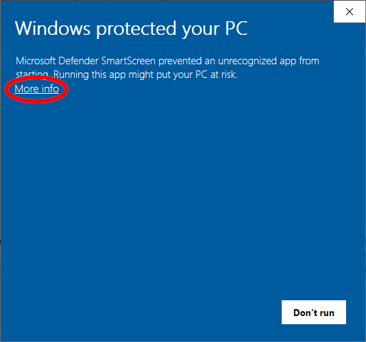
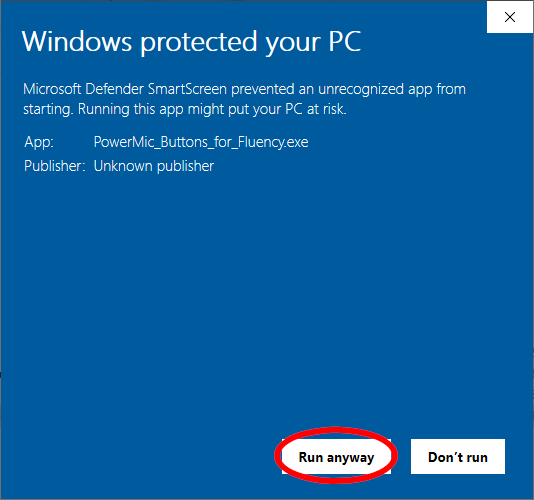
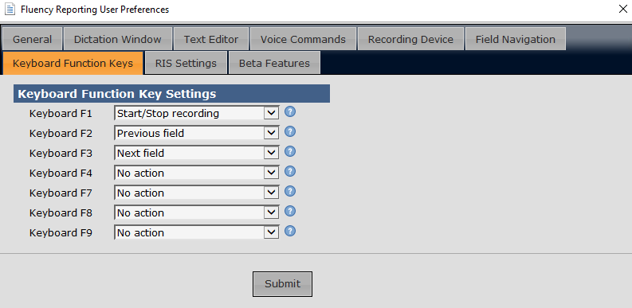

PowerMic Buttons for Fluency
============================

PowerMic Buttons for Fluency is an AutoHotkey script which persists as a tray icon, intercepts buttons on a PowerMic dictation microphone, and sends simulated function key presses to Fluency for Imaging Reporting.  

The compiled script can be downloaded [here](https://pcheng.org/powermic/PowerMic_Buttons_for_Fluency.exe).  Since this is an unsigned executable, a Windows Defender SmartScreen warning will typically appear on first execution in Windows 10.  Click on the "More info" link, then the "Run anyway" button to execute the script.  This warning is typical of unsigned compiled AutoHotkey scripts; if you are worried, scan the file with a virus checker, or review the source code and compile with [AutoHotkey](https://www.autohotkey.com).

 

Fluency should be configured to map the F1, F2, and F3 function keys to dictation, previous field, and next field functions in Fluency, as shown here:

Right click the microphone tray icon to see configuration options:

* Dictation Beep: Turn beep sound on/off when dictate button is pressed.
* Toggle Mode:  When unchecked (default), the PowerMic dictation button operates as a deadman switch, i.e. press and hold to dictate, release to stop dictation.  When checked ("Toggle Mode"), pressing the Dictation button activates the microphone, and pressing it again deactivates the microphone.  
* Active:  Turn script on/off (you can also double-click the tray icon).  This may be useful if you need to use the PowerMic intermittently in a program other than Fluency.  The tray icon turns red when the script is disabled.

If Fluency is running as an independent window recognizable by the host operating system, the script will send function key presses directly to the Fluency window.  Otherwise, if Fluency is running within a remote desktop, the script will send function key presses to the currently active window in the desktop, which may have unintended side effects.

The script can be used as a template for mapping PowerMic buttons to arbitrary system actions.  It uses the [AHKHID](https://github.com/jleb/AHKHID) library; if running or compiling from source, download [AHKHID.ahk](https://github.com/jleb/AHKHID/blob/master/AHKHID.ahk) and put it in the same folder as the main script.
