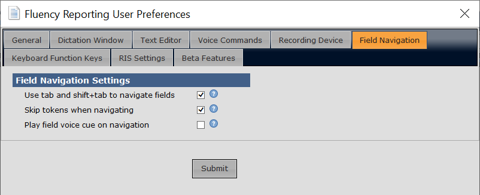
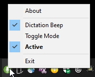

PowerMic Buttons for Fluency
============================

PowerMic Buttons for Fluency is an AutoHotkey script which persists as a tray icon, intercepts buttons on a PowerMic dictation microphone, and sends simulated key presses to Fluency for Imaging Reporting.  If Fluency is running within a VMWare window (my particular use case), then a second script "PowerMic Relay for Fluency" must be run within the VMWare session, which relays the appropriate key presses within the VMWare session.

The scripts can be downloaded [here](https://pcheng.org/powermic/PBF.zip).  Unzip the PBF.zip file, then extract it and run the executable "PowerMic_Buttons_for_Fluency.exe" on the system that has the PowerMic.  If applicable, run the executable "PowerMic_Relay_for_Fluency.exe" in the VMWare window.

Fluency should be configured to "Use tab and shift+tab to navigate fields", as shown here:

Right click the microphone tray icon to see configuration options:

* Dictation Beep: Turn beep sound on/off when dictate button is pressed.
* Toggle Mode:  When checked (default), pressing the Dictation button activates the microphone, and pressing it again deactivates the microphone.  When unchecked, the PowerMic dictation button operates as a deadman switch, i.e. press and hold to dictate, release to stop dictation.  
* Active:  Turn script on/off (you can also double-click the tray icon).  This may be useful if you need to use the PowerMic intermittently in a program other than Fluency.  The tray icon turns red when the script is disabled.

The script can be used as a template for mapping PowerMic buttons to arbitrary system actions.  It uses the [AHKHID](https://github.com/jleb/AHKHID) library; if running or compiling from source, download [AHKHID.ahk](https://github.com/jleb/AHKHID/blob/master/AHKHID.ahk) and put it in the same folder as the main script.  The [microphone icon](https://sites.google.com/site/photoadvancedsite/inkscape-vector-files) is from [@PhotoAdvanced2](https://www.youtube.com/watch?v=S3bdOJ6zVGQ).